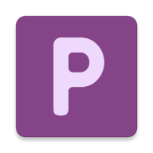
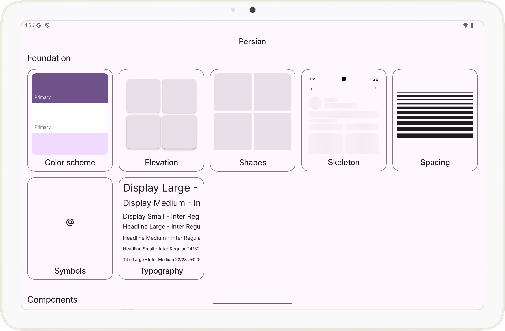

# Persian
[](http://kotlinlang.org)
[](https://central.sonatype.com/artifact/io.github.madmaximuus.persian/persian)

Persian is a design system built on the principles of Material 3 and Jetpack Compose.

All Persian content, guidelines, imagery, and resources are available under the [Apache 2.0](LICENSE) license.

|  |  |
|:-------------------------:|:-------------------------:|

## Import library
To start using Persian in your Compose app, add the dependency according to your dependencies declaration method:
### Version catalog
```toml
[versions]
persian="<version>"

[libraries]
persian={ group="io.github.madmaximuus.persian", name="persian", version.ref="persian" }
```
```kotlin
dependencies {
    implementation(libs.persian)
}
```
### Kotlin DSL
```kotlin
dependencies {
    implementation("io.github.madmaximuus.persian:persian:<version>")
}
```
### Groovy
```Groovy
dependencies {
    implementation "io.github.madmaximuus.persian:persian:<version>"
}
```
## 🤖 Catalog app

For testing purposes, this project provides a catalog app.

You can download catalog app to your android phone or tablet via google play.

<a href="https://play.google.com/store/apps/details?id=ru.rabbit.persian.appShowcase&utm_source=global_co&utm_medium=prtnr&utm_content=Mar2515&utm_campaign=PartBadge">

</a>

## Documentation

Visit the [documentation](/docs/index) to get more information about the project, some documentation, its API reference and the catalog app. 
